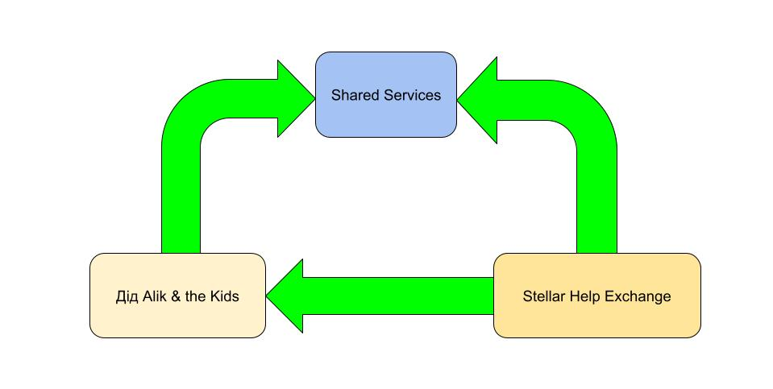

# Securely Shared Cloud-Based Services

The idea behind this project is simple. A _Service Owner_ creates and shares a service in the cloud. A _Service Agent_ has resources to run the service and is authorized by the Owner to offer the service to _Service Users_. Each User is authorized by an Agent to use the service. The Owner can have both Agent and User roles. An Agent can also have a User role.

To use the service, the User waits to bind to a first available Agent. Having bound, the User consumes the service from the Agent.

# The Example

A guest User is created when someone hits the site. Guest Users don't persist. The Agent here is readily available for a guest, so that guests do not have to wait to bind. The Agent can be bound to multiple guests. The Agent keeps the history of hits for this site. When a guest binds to the Agent, the Agent sends the history to the guest and receives the guest's geolocation. Then the Agent shares this geolocation with all currently bound guests and adds is to the history. The history is being stored on the Agent's host.

# Old Stuff: Shared services of [the Org](https://github.com/didalik/role-based-org/blob/main/README.md)



Hi there, I'm Дід Alik - the founder of the _Дід Alik & the Kids_ distributed organisation (**the Org**). This document introduces our shared services and presents some use cases. [The first implementation of the shared services](https://github.com/amissine/shex#shared-services) appeared in my Stellar Help Exchange (**HEX**) hobby project. Then I kept adding and using more services until I realized the services are the cornerstone of the Org.

## Using the services to join the Org

```
_o_  +-------+ +-----------+ +-------+
 A   | Admit | | Bootstrap | | Vault |
kid  +-------+ +-----------+ +-------+
 | apply |           |           |
 |------>|           |           |
 |       |           |           |
 | admit |           |           |
 |<------|           |           |
 |                   |           |
 | configure         |           |
 |------------------>|           |
 |                   | get repos |
 |                   |---------->|
 |         put repos |
 |<------------------|
```

To join the Org, a kid uses three services: _Admit_, _Bootstrap_, and _Vault_. Once upon a time, there was a kid (Дід Alik) who created these services. And then Дід Alik used them to join the Org. To create a service, Дід Alik used a git repo (a submodule, to be precise) called _genesis_. Of course, he had to create it first.

## The _genesis_ submodule
The _genesis_ submodule creates and maintains a distributed (shared) service, which is also a submodule. The basic idea of a shared service is that a service **owner** adds a service to the service repository, then a service **agent** offers it to kids, and a service **user** binds with the agent to use the service's API (e.g., _admit.apply_, _bootstrap.configure_, _vault.getrepos_).

The submodule makes use of [Cloudflare Pub/Sub](https://developers.cloudflare.com/pub-sub/) API. It is presently being mocked by a CFW DO.

## Mapping [Cloudflare Pub/Sub concepts](https://developers.cloudflare.com/pub-sub/learning/how-pubsub-works/) to services

A _broker_ groups together a set of _authenticated_ agents and users of one or more services. In this sense it is mapped to a service repository. A _topic_ is mapped to a service. Therefore, a _namespace_ is mapped to a set of (sets of) service repositories. For example, 'the Org' would be a namespace for brokers 'Admit', 'Bootstrap', 'Vault'. Or, "All Our Projects" would be a namespace for brokers "Org", "svc", "HEX". If we follow this logic, we find that a _namespace_ can awlays be thought of as a _broker_ - in order to prevent this expansion, we need to see (define?) the difference between a broker and a namespace.

## TODOs

- June 14, 2023. Get rid of `stellar-sdk` dependency, 372.6kb => 25.2kb + 37.4kb sourcemap. Done June 25.

- June 25. Push the `registry` and `genesis` repos to the Vault, store the info in the `svc-registry` CFW DO. Remember the `rm -rf .git/modules/org` thing. Done July 2.
